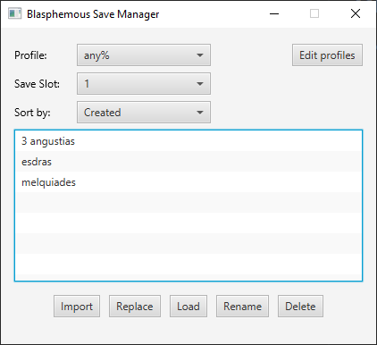
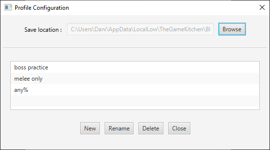

# BlasphemousSaveManager

The Blasphemous Save Manager is a tool for managing your blasphemous save files.

## How to use




### Create and select a profile

1. Click the "Edit profiles" button.
2. Click on the "New" button on the profiles window and give your profile a name and click "Accept".
3. On the main window select your profile.

### Rename a profile

1. Click the "Edit profiles" button.
2. Select a profile from the list.
3. Click the "Rename" button.
4. Type in the popup the new name for the profile.
5. Click the "Accept" button to save the changes.

### Configure the save path

1. Locate the location where the game stores your save files (Something like ```C:\Users\<your name>\AppData\LocalLow\TheGameKitchen\Blasphemous\Savegames\3214762178462817```)
2. Click the "Browse" button, navigate to said folder and click accept.

### Import a save to the manager

1. Select the "save slot" matching the save position that you want to import to the manager.
2. Click the "Import" button to add it to the profile save list.

### Load a save

1. Select the "save slot" where you want to load the save.
2. Select a save from the list.
3. Click the load button. (Doing this will overwrite the save in the saved slot)

### Rename a save

1. Select a save from the list.
2. Click the "Rename" button.
3. Type in the popup the new name for the save.
4. Click the "Accept" button to save the changes.

or

1. Right-click a save from the list.
2. Click the "Rename" option from the popup menu.
3. Type in the popup the new name for the save.
4. Click the "Accept" button to save the changes.

### Replace a save from the list with a new save

1. Select a save from the list.
2. Select the slot with the game file to replace it.
3. Click the "Replace" button.
4. Click the "Accept" button to save the changes.

### Delete a save

1. Select a save from the list.
2. Click the "Delete" button.
3. Click accept.

or

1. Right-click a save from the list.
2. Click the "Delete" option from the popup menu.
3. Click accept.

----
## Requirements

* Java JRE 8

----
## Download

Download the [latest release](https://github.com/danimroca/BlasphemousSaveManager/releases/) to any folder and run it (No install required).